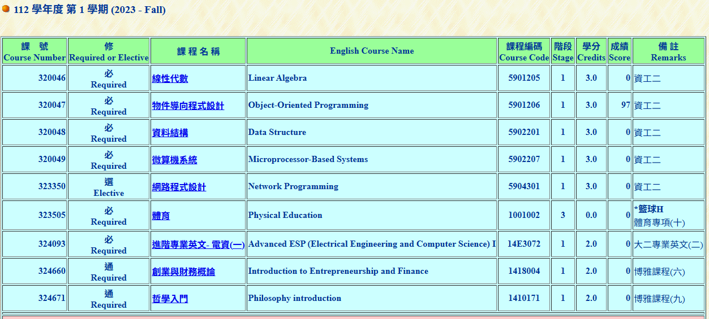

<<<<<<< HEAD
# Abstract

遊戲名稱：Giraffe Adventure v2

組員：

- 111590004 張意昌

# Game Introduction

描述你的遊戲內容與簡介，並且描述期望完成的內容。請額外確認你的遊戲至少要包含「會死掉」、「會獲勝」與「有關卡」三種屬性。
並且，如果有遊戲影片，附上你的遊戲影片以利於讓我們瞭解你的遊戲內容。

# Development timeline

- Week 1：準備素材
  - [ ] 蒐集遊戲的素材
- Week 2：處理遊戲的封面
  - [ ] 處理遊戲封面的素材
  - [ ] 進行遊戲封面的設計
- Week 3：（某個主題）
- Week 4：（某個主題）

# OOP 修課證明 (if you need)

=======
# Abstract

遊戲名稱：洛克人

組員：

- 111590004 張意昌

# Game Introduction

洛克人是一款 2D 類型卷軸 RPG 遊戲，玩家必須要擊倒 6 隻 Boss 後進入最後一關。  
在打每關之後會獲得不同屬性的洛克人，玩家必須要了解不同屬性在地圖上的優勢，才能發揮最大的效果。  

[遊戲連結](https://www.youtube.com/watch?v=2BGA79PKaZ8)

# Development timeline

- Week 01：撰寫 Proposal、完成練習
  - [ ] 項目一
  - [ ] 項目二
- Week 02：蒐集素材
  - [ ] 項目一
  - [ ] 項目二
- Week 03：蒐集素材
  - [ ] 項目一
  - [ ] 項目二
- Week 04：製作地圖、過關動畫
  - [ ] 項目一
  - [ ] 項目二
- Week 05：製作地圖、攝影機
  - [ ] 項目一
  - [ ] 項目二
- Week 06：製作怪物
  - [ ] 項目一
  - [ ] 項目二
- Week 07：製作怪物
  - [ ] 項目一
  - [ ] 項目二
- Week 08：期中 Demo
  - [ ] 項目一
  - [ ] 項目二
- Week 09：期中 Demo
  - [ ] 項目一
  - [ ] 項目二
- Week 10：製作洛克人
  - [ ] 項目一
  - [ ] 項目二
- Week 11：製作洛克人
  - [ ] 項目一
  - [ ] 項目二
- Week 12：製作道具
  - [ ] 項目一
  - [ ] 項目二
- Week 13：製作道具
  - [ ] 項目一
  - [ ] 項目二
- Week 14：製作道具
  - [ ] 項目一
  - [ ] 項目二
- Week 15：製作第二關
  - [ ] 項目一
  - [ ] 項目二
- Week 16：製作第二關
  - [ ] 項目一
  - [ ] 項目二
- Week 17：提交
  - [ ] 拍攝影片
  - [ ] 製作遊戲簡報
  - [ ] 驗收並提交

# OOP 修課證明 (if you need)

>>>>>>> 8c070eb394c67918f0418dc9d280b67751cba0d7
